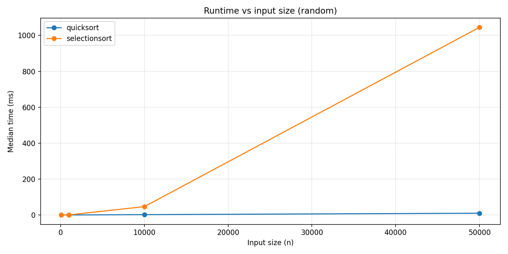
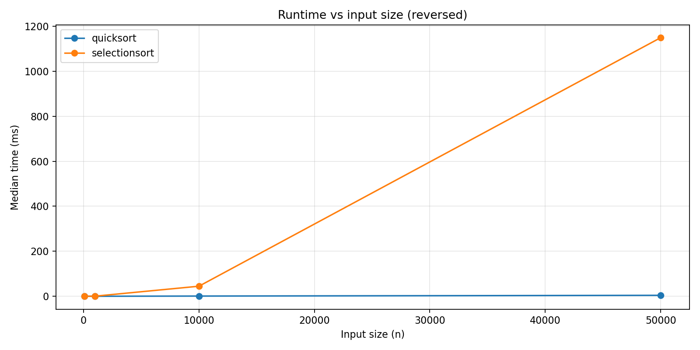
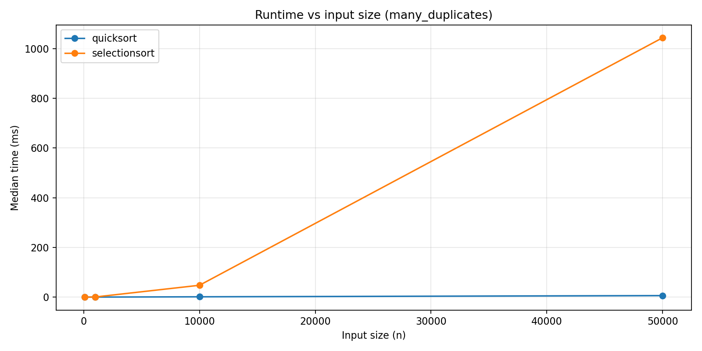

## Abstract
This document compares **QuickSort** and **Selection Sort** in terms of **how they work**, **time/space complexity**, and **practical performance** when implemented in **Java**. It also proposes an experimental setup to measure execution time across different input sizes and data distributions.

---

## 1. Background: What does it mean to “sort”?
Sorting arranges elements into a chosen order (typically ascending). In practice, the choice of sorting algorithm depends on:
- input size,
- input distribution (already sorted, random, reversed, many duplicates),
- memory constraints,
- stability requirements,
- and constant-factor performance on real machines.

---

## 2. QuickSort

### 2.1 Overview
QuickSort is a **divide-and-conquer** sorting algorithm. It repeatedly:
1. selects a **pivot** element,
2. partitions the array so that values lower than the **pivot** are placed before it and values higher than the **pivot** after it,
3. recursively sorts the left and right partitions.

If partitioning is balanced, the recursion depth stays small and the algorithm is very fast in practice.

---

### 2.2 Pivot selection strategies
Pivot selection has a large impact on performance:

- **First/last element**: simple, but can perform poorly on already-sorted or reverse-sorted inputs.
- **Random pivot**: reduces the chance of consistently bad partitions.
- **Median-of-three** (first, middle, last): often improves practical performance without heavy overhead.

**Java note:** for benchmarking, it’s common to implement either *random pivot* or *median-of-three* to reduce worst-case behavior in typical datasets.

---

### 2.3 Partitioning approaches
Partitioning is the core of QuickSort. Common schemes:

- **Lomuto partition**
  - easy to implement,
  - usually more swaps,
  - can be slower in practice.

- **Hoare partition**
  - fewer swaps on average,
  - typically faster,
  - but requires careful index handling.

---

### 2.4 Complexity
Let `n` be the array size.

- **Best case:** `O(n log n)` (partitions are balanced)
- **Average case:** `O(n log n)` (typical random input)
- **Worst case:** `O(n²)` (highly unbalanced partitions repeatedly)

**Space (in-place array)**
- Partitioning can be in-place, so extra memory is small.
- However, recursion uses call stack:
  - average: `O(log n)` stack depth
  - worst: `O(n)` stack depth

---

### 2.5 Advantages
- Very good performance on large arrays in typical scenarios.
- In-place partitioning: low additional memory usage.
- Often cache-friendly due to sequential scans during partitioning.

---

### 2.6 Disadvantages
- Worst-case time `O(n²)` if pivot choices produce bad partitions.
- Not stable in its common in-place forms (equal elements may change order).
- Recursive implementation can risk deep recursion on adversarial input (unless mitigated).

---

## 3. Selection Sort

### 3.1 Overview
Selection Sort is a simple comparison sort. For each position `i` from left to right:
1. find the smallest element in the unsorted part (`i..n-1`),
2. swap it into position `i`.

---

### 3.2 Complexity
- **Best / Average / Worst:** always `O(n²)` comparisons.
- **Swaps:** at most `n - 1` swaps (one per outer-loop step).

**Space:** `O(1)` extra space (in-place).

---

### 3.3 Advantages
- Very easy to implement and explain.
- Predictable behavior: always the same asymptotic time.
- Low number of writes/swaps, which can matter if writes are expensive.

---

### 3.4 Disadvantages
- Slow for medium/large inputs due to `O(n²)`.
- Not stable in the standard implementation.
- Generally not used in production for large datasets.

---

## 4. Side-by-side comparison

| Aspect          | QuickSort                     | Selection Sort              |
| --------------- | ----------------------------- | --------------------------- |
| Strategy        | Divide-and-conquer            | Repeated selection          |
| Typical time    | `O(n log n)`                  | `O(n²)`                     |
| Worst-case time | `O(n²)`                       | `O(n²)`                     |
| Extra memory    | small, recursion stack        | `O(1)`                      |
| Stable?         | usually no                    | usually no                  |
| Best use case   | large inputs, general-purpose | very small inputs, teaching |

---

## 5. Experimental plan to implement on section 6 of this research

### 5.1 Goal
Measure and compare execution time of both algorithms under different conditions, and visualize results.

### 5.2 Dataset sizes
Example sizes chosen to be used on this example:
- 10k, 20k, 30k, 40k and 50k (Selection Sort may be too slow beyond this depending on machine)

### 5.3 Input distributions
Test each size under:
- random values
- already sorted
- reverse sorted
- many duplicates (e.g., values in small range like 0..100)

---

## 6. Graphics and value-based comparison

### 6.1 Random values

### 6.2 Already sorted values

### 6.3 Reverse sorted values

### 6.4 Many duplicates on dataset

---

## 7. Conclusion

## Results and Discussion

This section presents the benchmark results obtained from the Java implementations of **QuickSort** (random pivot + Hoare partition) and **Selection Sort**. For each input size `n` and each dataset distribution, the program executed multiple trials and recorded the elapsed time in **nanoseconds** using `System.nanoTime()`. The charts below plot the **median runtime** per configuration (median is preferred over mean because it reduces the effect of outliers caused by OS scheduling, background processes, and JVM JIT effects).

### Experimental setup (summary)
- **Algorithms tested:** QuickSort and Selection Sort (custom implementations in Java).
- **Measured metric:** execution time to sort an `int[]` array (ns), later converted to **milliseconds** in plots.
- **Fairness control:** for each `(n, distribution)`, both algorithms were given identical input values (the base array was cloned before each run).
- **Correctness validation:** after each run, the program verified the array was sorted in ascending order.
- **Distributions tested:**
  1. **Random** values (general-case behavior)
  2. **Sorted** input (already ordered)
  3. **Reversed** input (descending order)
  4. **Many duplicates** (values drawn from a small range)

---

### 1) Random input
On random data, QuickSort consistently demonstrates lower growth than Selection Sort as `n` increases. This matches the expected asymptotic behavior:
- QuickSort typically behaves like **O(n log n)** on average.
- Selection Sort performs **O(n²)** comparisons regardless of input arrangement.

As `n` grows, the gap becomes very large. For small arrays (e.g., `n=100`), the difference may be less dramatic because constant overheads (method calls, JVM/JIT effects, and array access costs) represent a larger portion of the total runtime. For larger arrays (e.g., `n=10,000` and above), Selection Sort scales poorly and quickly becomes impractical compared to QuickSort.

**Interpretation:** the random-input chart is the best “general purpose” comparison and shows why QuickSort (and other `n log n` algorithms) are preferred for large datasets.

---

### 2) Sorted input
On already sorted arrays, Selection Sort still performs the same fundamental work: it repeatedly scans the unsorted suffix to find the minimum, so its runtime remains dominated by **O(n²)** comparisons. Therefore, the sorted-input chart should look similar in shape to random input for Selection Sort.

QuickSort’s behavior on sorted input depends heavily on **pivot strategy**. If QuickSort always chooses the first/last element as pivot, sorted input can trigger the classic **worst case O(n²)** due to highly unbalanced partitions. In this project, QuickSort uses a **random pivot**, which greatly reduces the probability of repeatedly bad partitions. As a result, QuickSort remains efficient and typically stays closer to its average-case growth.

**Interpretation:** the sorted-input chart highlights an important engineering point: QuickSort can be very fast, but its worst-case risk is tied to pivot selection. Randomized pivot selection is a simple and effective mitigation.

---

### 3) Reversed input
Reversed arrays can also be adversarial for certain QuickSort pivot choices. Similar to the sorted case, Selection Sort continues to exhibit **O(n²)** behavior because its nested-loop structure does not benefit from any existing order.

QuickSort remains efficient here for the same reason as above: randomized pivot selection makes it unlikely to always partition in the most unbalanced way. However, small variations between sorted and reversed inputs can still appear due to differences in branch prediction and memory access patterns during partitioning.

**Interpretation:** reversed input reinforces that Selection Sort does not adapt to input order, while QuickSort remains practical when implemented with a pivot strategy designed to avoid predictable worst cases.

---

### 4) Many duplicates
Arrays with many repeated values are an important practical case (for example, categorical data or bounded-range measurements). Selection Sort again does not gain a meaningful advantage from duplicates, since it still scans the remainder of the array on every outer iteration.

For QuickSort, duplicates can affect partitioning depending on how comparisons are handled. A two-way partition scheme can spend extra work swapping values equal to the pivot. Even so, QuickSort generally remains much faster than Selection Sort for moderate and large `n`. In some cases, a **three-way partition** (a.k.a. “Dutch National Flag” partitioning) can further improve performance with many duplicates by grouping `< pivot`, `== pivot`, and `> pivot` in one pass.

**Interpretation:** the many-duplicates chart shows that dataset characteristics can influence performance, and it motivates potential improvements (e.g., three-way partition QuickSort) as future work.

---

### General observations and threats to validity
- **JVM warm-up and JIT compilation:** early trials can be slower or noisier. Using warm-up runs and aggregating results across many trials helps reduce this effect.
- **System noise:** background processes, CPU frequency scaling, and thermal throttling can affect timing. Running multiple trials and using the median reduces the impact.
- **Measurement scope:** these benchmarks measure only the sorting time, not input generation or file I/O. This isolates algorithm performance more clearly.
- **Hardware dependence:** absolute runtimes will differ across machines; however, the overall scaling behavior and relative differences between `O(n log n)` and `O(n²)` algorithms should remain consistent.

---

### Conclusion from the graphs
Across all tested input distributions, **QuickSort scales significantly better** than **Selection Sort** as the array size increases. Selection Sort may be acceptable for very small inputs or educational purposes, but the experimental results support the theoretical expectation that `n log n` algorithms dominate `n²` algorithms for large datasets. QuickSort’s performance is strong in practice when implemented with a pivot strategy that avoids predictable worst cases.

---

## References
- Tests made by myself using different datasets sizes.
- geeksforgeeks.org
- stackoverflow.com
- analysis 
